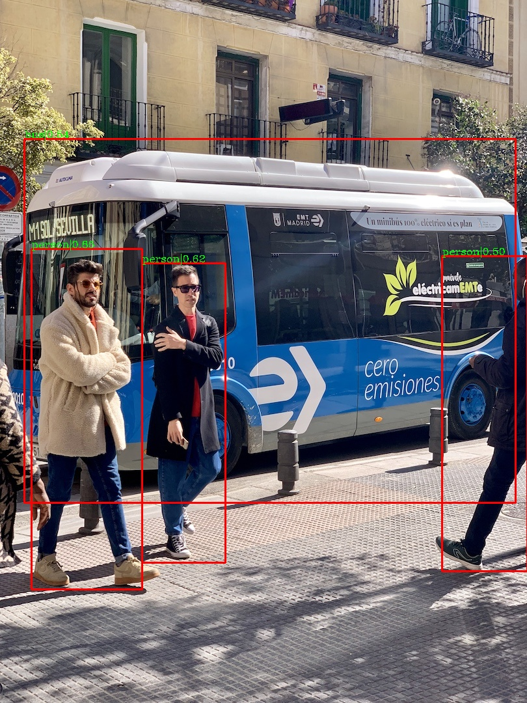
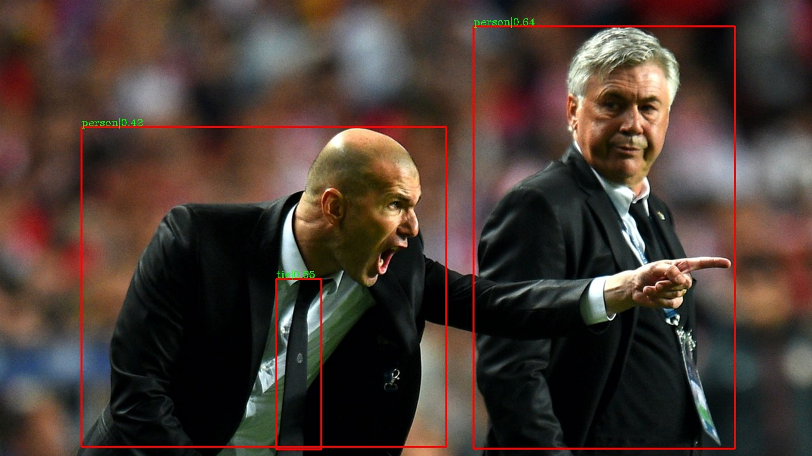
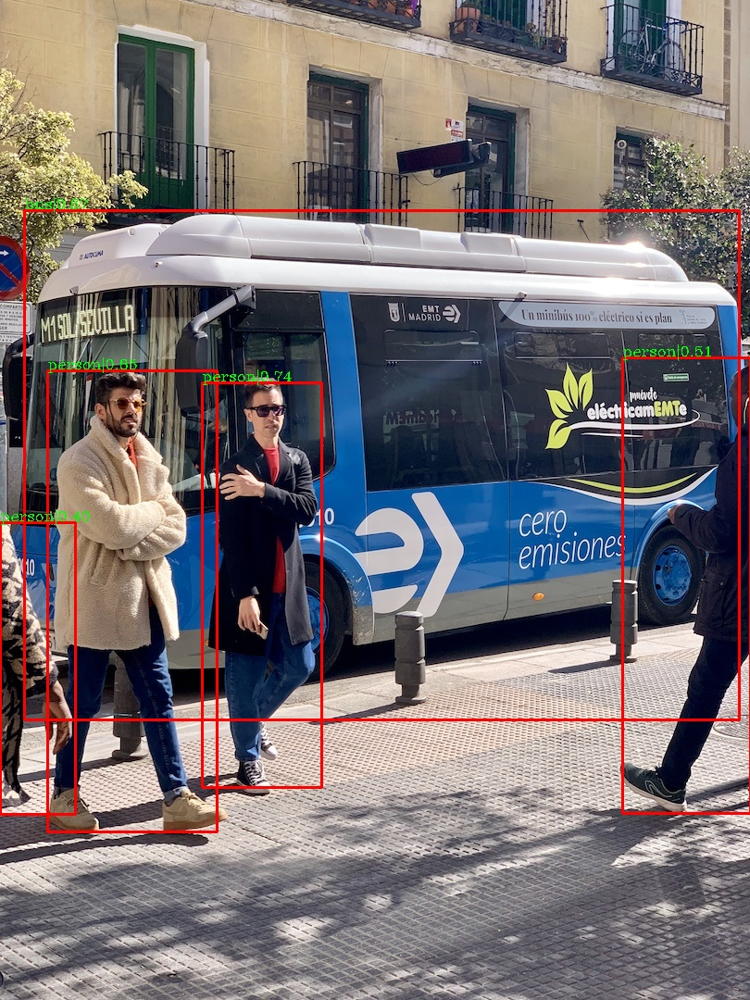
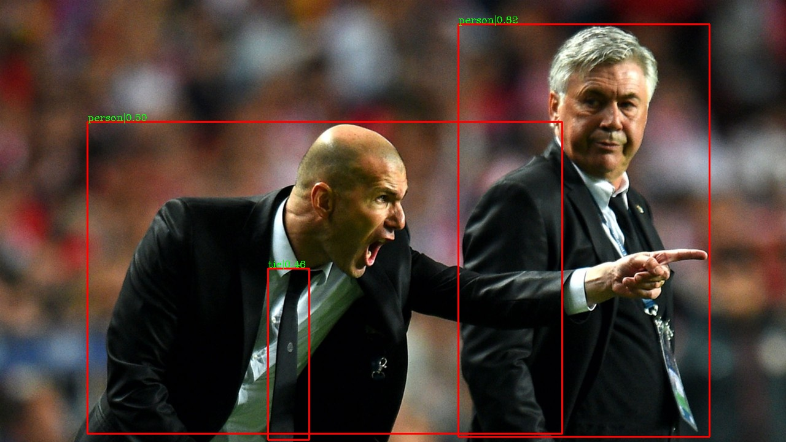

[简体中文](MODEL_ZOO_cn.md)|English

  

# Model Libraries And Bbaselines

  

## Test Environment

- Python 3.7

- PyTorch >=1.5

- CUDA 10.1

### YOLO

  

- **Important note:** Due to my limited resources, only a single 1080Ti video card can be used for training, and the training cycle is long after the complete training.To illustrate this framework is trainable, inferential, and testable.The pre-training model given in this paper is only the model of 24 epoch trained, and the loss value is still declining, which has not been fully trained, so it is only for your reference.Developers with the right conditions can complete this training, and I hope you can train the good pre-training model to provide, for everyone to use.I will also make a statement and thank you in an important place.

| network | pre-training data set | input size | epoch | graphics card type |inference time (FPS) |cocotools APval| AP50 | baidu network disk | Google network disk | configuration file |logs | 
| :--------: | :--: | :-----: | :-----: |:------------: |:----: | :-------: | :----: | :-------: | :-------: |  :-------: |    :-------: | 
| YOLOv4   | MSCOCO | 608  |24 |2070|23ms|32.3|35.9|  [link](https://pan.baidu.com/s/1InedBkJcR_j6E6vuDZnH-w) Extra code:yolo  | [link](https://drive.google.com/file/d/1Yh0JY_vd8F1AUfTyK2Y69P2elX7LqGA-/view?usp=sharing) | [config file](https://github.com/wuzhihao7788/yolodet-pytorch/blob/master/cfg/yolov4_coco_100e.py) |  [Statistical log](https://github.com/wuzhihao7788/yolodet-pytorch/blob/master/docs/logs/yolov4.log) |
| YOLOv5-l   | MSCOCO | 640|24 |  2070  | 19ms  |32.5|37.5|  [link](https://pan.baidu.com/s/1m1DYtyEqCBmwK7Gq0BWB8w) Extra code:yolo  | [link](https://drive.google.com/file/d/16YcoQLlD7bYlQtHoBb1vf25Sx7lLNZFh/view?usp=sharing) | [config file](https://github.com/wuzhihao7788/yolodet-pytorch/blob/master/cfg/yolov5_coco_100e.py) | [Statistical log](https://github.com/wuzhihao7788/yolodet-pytorch/blob/master/docs/logs/yolov5-l.log) | 
| PP-YOLO   | MSCOCO | 608 |24 |  2070  | 20ms | 44.5  |  49.4   |  [link](https://pan.baidu.com/s/1Kso34r_um0iy4Emso5Jlqw) Extra code:yolo  | [link](https://drive.google.com/file/d/1k0VEQjG9SU5eBsyy0n3eBciAW0byD7rD/view?usp=sharing) | [config file](https://github.com/wuzhihao7788/yolodet-pytorch/blob/master/cfg/ppyolo_coco_100e.py) | [Statistical log](https://github.com/wuzhihao7788/yolodet-pytorch/blob/master/docs/logs/ppyolo.log) | 
| YOLOv4-sam   | MSCOCO | 608  |33 |2070|22ms|34.6| 38.1|  [link](https://pan.baidu.com/s/1InedBkJcR_j6E6vuDZnH-w) Extra code:yolo  | [link](https://drive.google.com/file/d/1YgKoYfz7MVPRhANgWsNLRW3kMpnZY158/view?usp=sharing) | [config file](https://github.com/wuzhihao7788/yolodet-pytorch/blob/master/cfg/yolov4_sam_coco_100e.py) |  [Statistical log](https://github.com/wuzhihao7788/yolodet-pytorch/blob/master/docs/logs/yolov4-sam.log) |
| YOLOv5-l+TTA   | MSCOCO | 640|24 |  2070  | 52ms  |33.6|38.3|  [link](https://pan.baidu.com/s/1m1DYtyEqCBmwK7Gq0BWB8w) Extra code:yolo  | [link](https://drive.google.com/file/d/16YcoQLlD7bYlQtHoBb1vf25Sx7lLNZFh/view?usp=sharing) | [config file](https://github.com/wuzhihao7788/yolodet-pytorch/blob/master/cfg/yolov5_coco_100e.py) | [Statistical log](https://github.com/wuzhihao7788/yolodet-pytorch/blob/master/docs/logs/yolov5-l-tta.log) | 
| YOLOv4+TTA   | MSCOCO | 640|24 |  2070  | 59ms  |32.9|36.2|  [link](https://pan.baidu.com/s/1InedBkJcR_j6E6vuDZnH-w) Extra code:yolo  | [link](https://drive.google.com/file/d/1Yh0JY_vd8F1AUfTyK2Y69P2elX7LqGA-/view?usp=sharing) | [config file](https://github.com/wuzhihao7788/yolodet-pytorch/blob/master/cfg/yolov5_coco_100e.py) | [Statistical log](https://github.com/wuzhihao7788/yolodet-pytorch/blob/master/docs/logs/yolov4-tta.log) | 

- Rendering

  
  

- YOLOv4：

  

- YOLOv5-l:

  

- PP-YOLO:

 - YOLOv4-sam：
 

  

  

