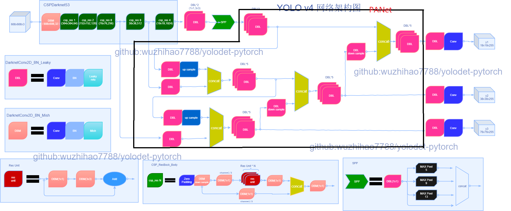

简体中文 | [English](yolov4.md)

# YOLOv4 模型

## 内容
- [简介](#简介)
- [网络结构和特点](#网络结构和特点)
- [训练技巧](#训练技巧)
- [如何使用](#如何使用)

## 简介

[YOLOv4](https://arxiv.org/abs/2004.10934)在网络结构层面和YOLOv3没有太大改变。只是骨干网络由CSPDarknet53替代了原始的Darknet53，同时引入SPP和PAN思想进行不同尺度的特征融合。

- 提出了一种高效而强大的目标检测模型。它使每个人都可以使用1080 Ti或2080 Ti GPU 训练超快速和准确的目标检测器。
- 验证了很多近几年 SOTA 的深度学习目标检测训练技巧。
- 修改了很多 SOTA 的方法， 让它们对单GPU训练更加高效，例如 CBN，PAN，SAM等

## 网络结构和特点
#### 网络结构
<div align="center">
  
</div>

#### 网络细节
采用[Netron](https://github.com/lutzroeder/Netron)可视化YOLOv4模型结构
点击【[这里](./images/yolov4-detail.png)】查看细节

#### YOLOv4特点：
- 骨干网络: CSPDarknet53
- [Mish activation](https://arxiv.org/abs/1908.08681)
- [FPN+PAN结构](https://arxiv.org/abs/1803.01534)
- [DIoU Loss](https://arxiv.org/pdf/1902.09630.pdf)
- [Spatial Pyramid Pooling](https://arxiv.org/abs/1406.4729)
- Mosaic
-  Label Smooth
- SAM(Spartial Attention Module)

## 训练技巧
- [指数移动平均](https://www.tensorflow.org/api_docs/python/tf/train/ExponentialMovingAverage)
- 预热
- 梯度剪切
- 梯度累计更新
- 多尺度训练
- 学习率调整：Consine
- Label Smooth
- 有关正负样本划分定义，在实际实验对比发现采用YOLOv5正负样本划分定义和损失函数定义，能使模型收敛速度更快，超过原YOLO系列对正负样本的划分和损失定义。对于如果卡资源不充足，想在短时间内收敛模型，可采用yolov5的正负样本划分和损失函数定义，收敛模型。默认是采用YOLOv5的方式，相关参数为`yolo_loss_type=yolov5`，具体细节可参考YOLOv5章节说明。设置为None或yolov4将采用原始YOLO系列损失函数。

## 如何使用

### 准备
自行准备训练需要的数据集，指定需要训练的数据位置，具体操作请查看【[这里](INSTALL_cn.md)】有关数据集准备。
找到yolov4的配置文件，修改如下部分内容
```python
data = dict(  
  batch_size=64,  #累计批次大小，框架会到累计到该批次大小后累计更新梯度
  subdivisions=8,  #分批次数量，实际批次大小为batch_size/subdivisions,视你自己的机器配置修改该值大小。如果显存充足该值可设置小一些，如果显存不足，该值可设置大一些。
  workers_per_gpu=2,  #dataloader加载数据工作线程数量
  train=dict(  
        type='Custom',  
  data_root=r'xxxx',  #训练数据根目录
  ann_file=r'annotations/train.txt', #标签文件位置，相对路径。data_root+ann_file
  img_prefix='images', #图片存放路径目录，相对路径。  data_root+img_prefix
  name_file='annotations/label.names', #标签索引对应名称 
  pipeline=train_pipeline  
    ),  
  val=dict(  
        type='Custom',  
  data_root=r'xxxx',  #同上
  ann_file=r'annotations/val.txt',  #同上
  img_prefix='images',  #同上
  name_file='annotations/label.names',  #同上
  pipeline=val_pipeline  
    ),  
  test=dict(  
        type='Custom',  
  data_root=r'xxx',  #同上
  ann_file=r'annotations/test.txt',  #同上
  img_prefix='images',  #同上
  name_file='annotations/label.names',  #同上
  pipeline=test_pipeline  
    )  
)
```


### 使用GPU训练
```shell
python tools/train.py ${CONFIG_FILE}
```
如果您想在命令中指定工作目录，可以添加一个参数`--work_dir ${YOUR_WORK_DIR}`。
例如采用YOLOv4训练模型:
```shell
python tools/train.py cfg/yolov4_coco_100e.py --device ${device} --validate
```

### 使用指定gpu训练

```shell
python tools/train.py ${CONFIG_FILE} --device ${device} [optional arguments]
```
例如采用YOLOv4训练模型:
```shell
python tools/train.py cfg/yolov4_coco_100e.py --device 0,1,2 --validate
```

可选参数:

- `--validate`(**强烈建议**):在训练epoch期间每一次k(默认值是1，可以像这样修改[this](../cfg/yolov4_coco_gpu.py#L138))来执行评估。

- `--work_dir ${WORK_DIR}`:覆盖配置文件中指定的工作目录。
- `--device ${device}`: 指定device训练, 0 or 0,1,2,3 or cpu，默认全部使用。

- `--resume_from ${CHECKPOINT_FILE}`:从以前训练的checkpoints文件恢复训练。
- `--multi-scale`:多尺度缩放，尺寸范围为训练图片尺寸+/- 50%

`resume_from` 和`load_from`的不同:

`resume_from`加载模型权重和优化器状态，并且训练也从指定的检查点继续训练。它通常用于恢复意外中断的训练。
`load_from`只加载模型权重，并且训练从epoch 0开始。它通常用于微调。

