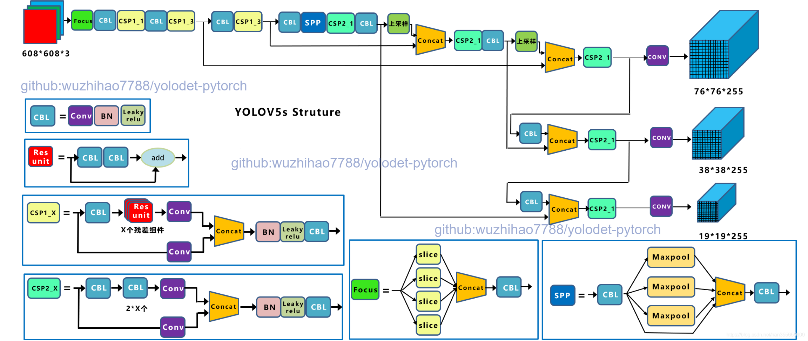

简体中文 | [English](yolov5.md)

# YOLOv5 模型

## 内容
- [简介](#简介)
- [网络结构和特点](#网络结构和特点)
- [训练技巧](#训练技巧)
- [如何使用](#如何使用)

## 简介

Yolov5在结构上和YOLOv4很像，不同点在于他的配置更灵活，可轻松配置网络的深度和广度，共给出4个版本的网络，分别是**Yolov5s、Yolov5m、Yolov5l、Yolov5x**四个模型，每个模型的结构的不同在于BottleneckCSP模块的深度（块数量）和广度（通道数）不同，可以满足配置型号的机器，此设计结构跟google的EfficientNet很像，同样考虑网络的深度，广度和分辨率对模型的影响。
## 网络结构和特点
#### 网络结构
<div align="center">
  
</div>

#### 网络细节
采用[Netron](https://github.com/lutzroeder/Netron)可视化yolov5x模型结构
点击【[这里](./images/yolov5x-detail.png)】查看细节

#### YOLOv5特点及技巧点：
- 骨干网络: Focus结构，CSP结构
- [Mish activation](https://arxiv.org/abs/1908.08681)
- [FPN+PAN结构](https://arxiv.org/abs/1803.01534)
- [GIOU_Loss](https://arxiv.org/pdf/1902.09630.pdf)
- [Spatial Pyramid Pooling](https://arxiv.org/abs/1406.4729)
- Mosaic
- 支持自适应锚框计算
- 推断支持自适应图片缩放
- Label Smooth
- Focal Loss
- 自定义正样本

## 训练技巧
- [指数移动平均](https://www.tensorflow.org/api_docs/python/tf/train/ExponentialMovingAverage)
- 预热
- 梯度剪切
- 梯度累计更新
- 多尺度训练
- 学习率调整：Consine
- Label Smooth
- YOLOv5对于正样本的定义:在不同尺度锚框下只要真框和给定锚框的的比值在4倍以内，该锚框即可负责预测该真值框。并根据gx,gy在grid中心点位置的偏移量会额外新增两个grid坐标来预测。通过这一系列操作，增加了正样本数量，加速模型收敛速度。而YOLO原系列对于真框，在不同尺度下只有在该尺度下IOU交并集最大的锚框负责预测该真框，其他锚框不负责，所以由于较少的正样本量，模型收敛速度较慢。

## 如何使用

### 准备

自行准备训练需要的数据集，指定需要训练的数据位置，具体操作请查看【[这里](INSTALL_cn.md)】。有关数据集准备，可查看yolov4相关章节，点击【[这里](yolov4_cn.md)】快速到达。


### 使用GPU训练
```shell
python tools/train.py ${CONFIG_FILE}
```
如果您想在命令中指定工作目录，可以添加一个参数`--work_dir ${YOUR_WORK_DIR}`。
例如采用YOLOv4训练模型:
```shell
python tools/train.py cfg/yolov4_coco_100e.py --device ${device} --validate
```

### 使用指定gpu训练

```shell
python tools/train.py ${CONFIG_FILE} --device ${device} [optional arguments]
```
例如采用YOLOv4训练模型:
```shell
python tools/train.py cfg/yolov4_coco_100e.py --device 0,1,2 --validate
```

可选参数:

- `--validate`(**强烈建议**):在训练epoch期间每一次k(默认值是1，可以像这样修改[this](../cfg/yolov4_coco_gpu.py#L138))来执行评估。

- `--work_dir ${WORK_DIR}`:覆盖配置文件中指定的工作目录。
- `--device ${device}`: 指定device训练, 0 or 0,1,2,3 or cpu，默认全部使用。

- `--resume_from ${CHECKPOINT_FILE}`:从以前训练的checkpoints文件恢复训练。
- `--multi-scale`:多尺度缩放，尺寸范围为训练图片尺寸+/- 50%

`resume_from` 和`load_from`的不同:

`resume_from`加载模型权重和优化器状态，并且训练也从指定的检查点继续训练。它通常用于恢复意外中断的训练。
`load_from`只加载模型权重，并且训练从epoch 0开始。它通常用于微调。


